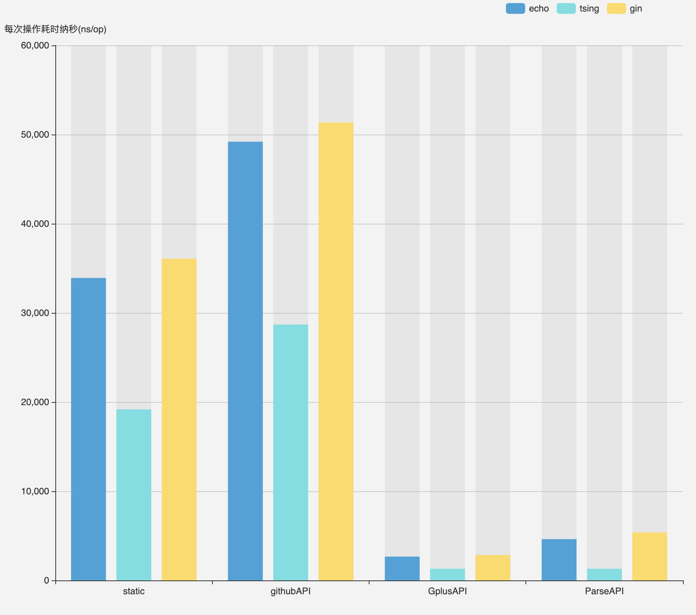

# web 框架基准测试

[中文文档](./README_ZH.md)｜[English](./README.md)
## 环境

- `dep`
- `go mod`

## 安装

```shell script
go get github.com/gorpher/web-framework-benchmark
```
## 初始化

```shell script
dep ensure

go mod init

go mod vendor
```

## 运行 Benchmark


```sh
go test -bench=.

```
参数说明：1.参数有-bench，它指明要测试的函数，点字符意思是测试当前所有以Benchmark为前缀函数。2.参数-benchmem，性能测试的时候显示测试函数的内存分配大小，内存分配次数的统计信息。3.参数-count n,运行测试和性能多少此，默认一次


## 运行结果

```shell script
BenchmarkEchoStatic-12             34622             33915 ns/op            2259 B/op        157 allocs/op
BenchmarkEchoGitHubAPI-12          24016             49195 ns/op            3071 B/op        203 allocs/op
BenchmarkEchoGplusAPI-12          440157              2672 ns/op             182 B/op         13 allocs/op
BenchmarkEchoParseAPI-12          254628              4627 ns/op             344 B/op         26 allocs/op
BenchmarkGinStatic-12              32190             36075 ns/op            8615 B/op        157 allocs/op
BenchmarkGinGitHubAPI-12           22512             51345 ns/op           11288 B/op        203 allocs/op
BenchmarkGinGplusAPI-12           369297              2847 ns/op             717 B/op         13 allocs/op
BenchmarkGinParseAPI-12           209614              5386 ns/op            1413 B/op         26 allocs/op
BenchmarkTsingStatic-12            60948             19177 ns/op            1450 B/op        157 allocs/op
BenchmarkTsingGitHubAPI-12         42900             28692 ns/op            2021 B/op        203 allocs/op
BenchmarkTsingGplusAPI-12         885289              1308 ns/op             104 B/op         13 allocs/op
BenchmarkTsingParseAPI-12         473202              2478 ns/op             198 B/op         26 allocs/op
```

## 结果分析

1. `BenchmarkEchoStatic-12`  表测试的函数名，-12 表示GOMAXPROCS（线程数）的值为12
2. `34622 `表一共执行了34622次，即B.N的值
3. `33915 ns/op`表平均每次操作花费了33915纳秒
4. `2259 B/op` 表每次操作申请了2259Byte的内存申请
5. `157 allocs/op` 表每次操作申请了157次内存


## 图表展示

[使用echats制图](https://echarts.apache.org/examples/zh/editor.html?c=bar-background&theme=light)


```js
option = {
    xAxis: {
        type: 'category',
        data: ["static","githubAPI","GplusAPI","ParseAPI"]
    },
     legend: {
        data: ['echo', 'tsing', 'gin'],
        right: 150
    },
    yAxis: {
       name:"每次操作耗时纳秒(ns/op)",
        type: 'value'
    },
    series: [{
          title:"echo",
          showTitle:true,
           name:"echo",
        data: [33915,49195,2672,4627],
        type: 'bar',
        showBackground: true
       
    },
    {
          title:"tsing",
          name:"tsing",
          showTitle:true,
        data: [19177,28692,1308,1308],
        type: 'bar',
        showBackground: true
       
    },
    {
        title:"gin",
            name:"gin",
            showTitle:true,
        data: [36075,51345,2847,5386],
        type: 'bar',
        showBackground: true
    },
    ]
};
```